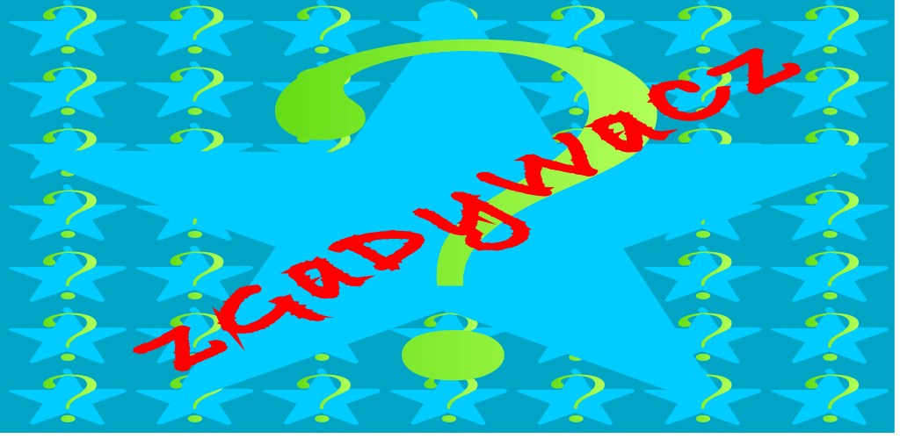
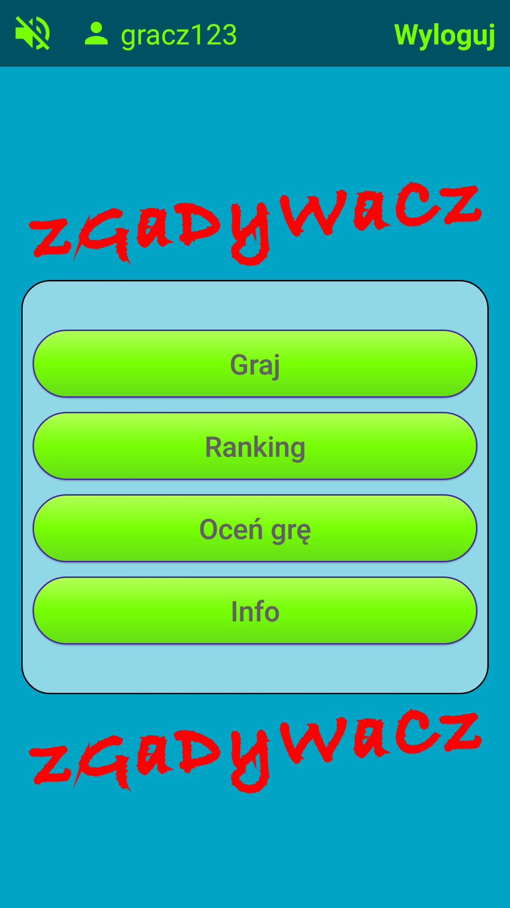
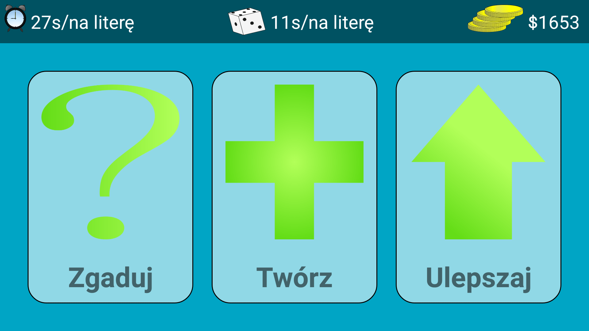
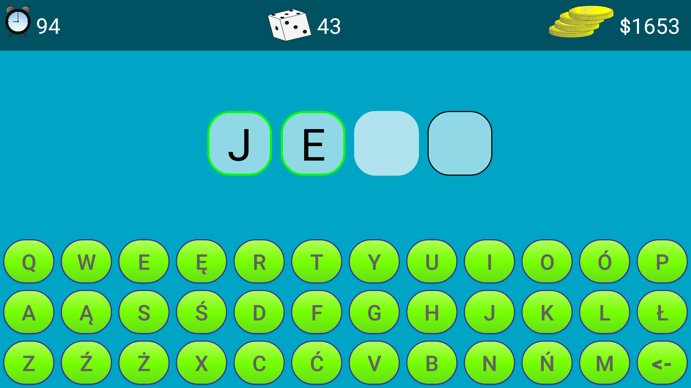
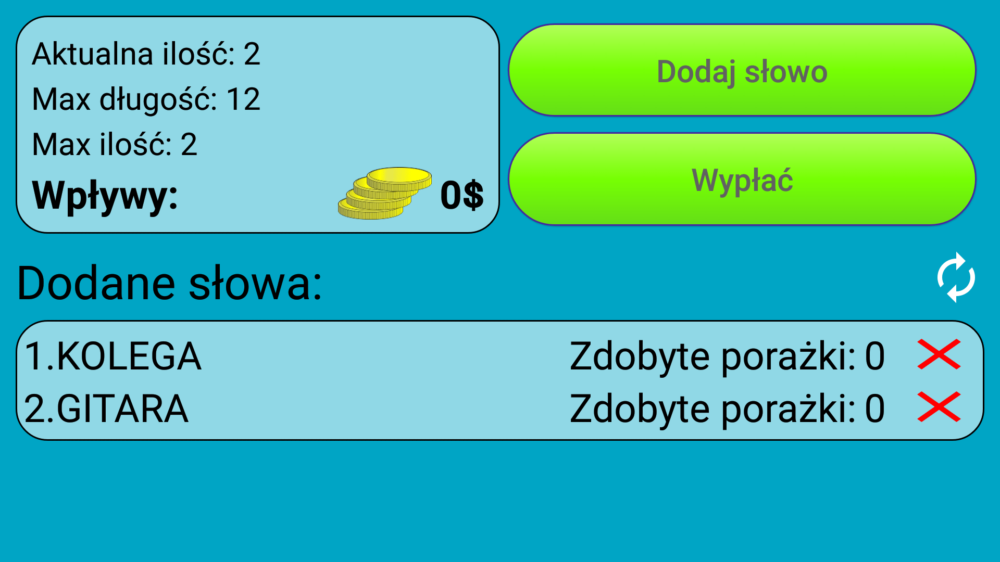
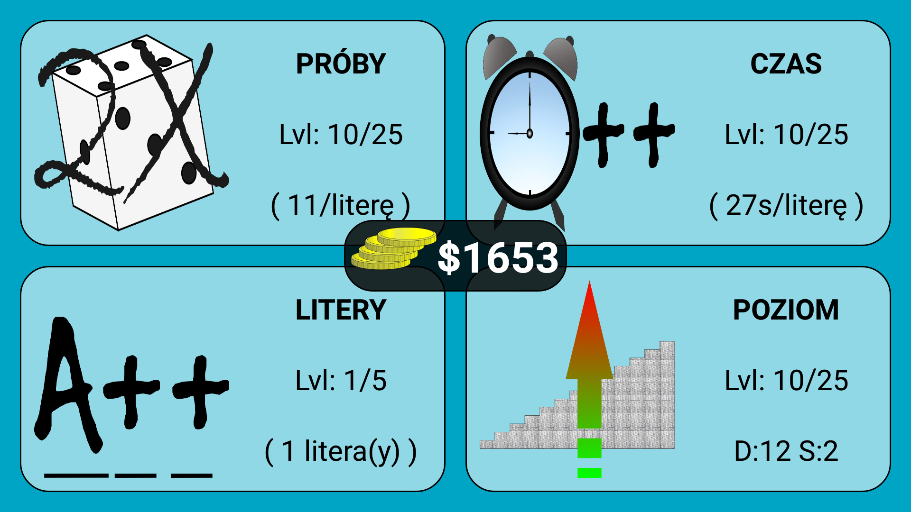
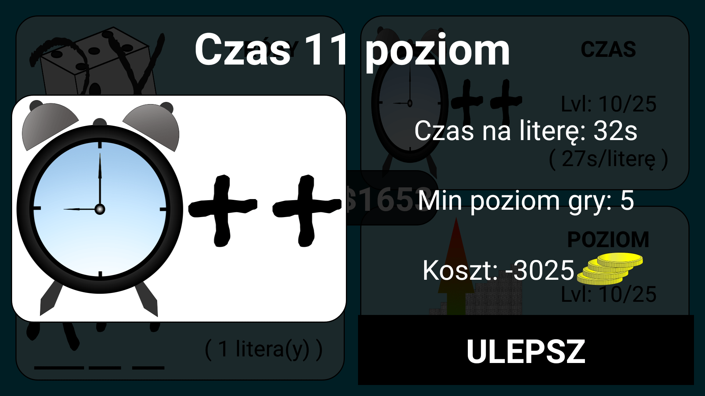
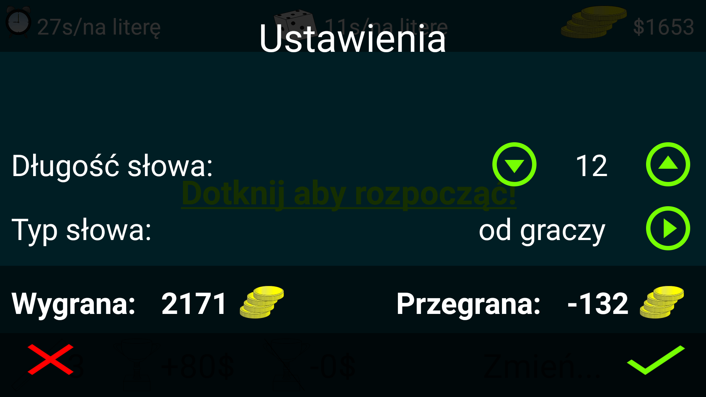

# zgadywacz
Android game application [See GooglePlay](https://play.google.com/store/apps/details?id=com.thirteendollars.zgadywacz&hl=en)

Guess words, come up with your own ones,share them with others and win coins that let you buy higher levels! 
You win when 25 game level is achieved. Application only in Polish language version.

### IMPORTANT NOTE
Project doesn't work appropriately because [parse.com](http://parseplatform.org/) service was fully retired.
